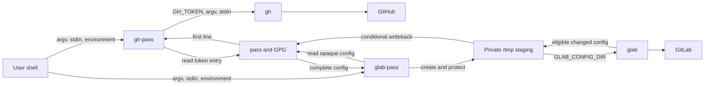

# forge-cli-pass

**Command-compatible security wrappers for ordinary authenticated GitHub CLI
and GitLab CLI operations, with
[`pass`](https://www.passwordstore.org/) as the authoritative credential
store.**

[](https://github.com/JeffreyCordova/forge-cli-pass/actions/workflows/ci.yml)
[](https://www.bestpractices.dev/projects/13640)
[](https://github.com/JeffreyCordova/forge-cli-pass/releases/latest)
[](LICENSE)

`forge-cli-pass` provides two commands:

| Wrapper | Parent CLI | Runtime authentication mechanism |
|---|---|---|
| `gh-pass` | GitHub CLI, `gh` | First line of a `pass` entry supplied through `GH_TOKEN` |
| `glab-pass` | GitLab CLI, `glab` | Complete opaque config staged in a private temporary directory |

Both wrappers preserve the parent CLI's ordinary command interface while
preventing the parent CLI from becoming the durable owner of wrapper-managed
authentication state.

> Wrapper-managed authentication state belongs in `pass`, not in persistent
> parent-CLI configuration.

The
[GitHub repository](https://github.com/JeffreyCordova/forge-cli-pass) is the
canonical upstream and release location. The
[GitLab repository](https://gitlab.com/JeffreyCordova/forge-cli-pass) mirrors
source and release tags.

## Why this exists

The GitHub and GitLab CLIs are designed to retain authentication state in their
normal configuration locations. That is convenient for many systems, but it
creates a credential-ownership model in which each CLI manages its own durable
local state.

`forge-cli-pass` selects a narrower model:

- `pass` owns durable wrapper-managed authentication state.
- Credentials are restored only for the command being run.
- The wrappers do not establish persistent parent-CLI login state.
- Temporary GitLab state is validated, conditionally persisted, and removed.
- Credential-management and credential-disclosure commands fail closed.
- Ordinary parent arguments, standard input, output streams, and exit behavior
  remain compatible.

The project is intentionally small, but the credential boundary is treated as
a security-sensitive system rather than as an informal shell alias.

## Security properties

The current design provides these properties under the assumptions documented
in the [threat model](docs/threat-model.md):

### Durable credential ownership

The documented `pass` entries are authoritative.

The wrappers do not fall back to parent-CLI credential discovery or silently
adopt authentication state from normal `gh` or `glab` configuration
directories.

### Provider-specific credential delivery

`gh-pass` and `glab-pass` use different mechanisms because their parent CLIs
expose different authentication interfaces:

- `gh-pass` injects one token through `GH_TOKEN`.
- `glab-pass` restores the complete GitLab CLI config as opaque state.

The wrappers share a credential-ownership policy without pretending the two
providers have identical runtime behavior.

### Private GitLab staging

`glab-pass` creates an unpredictable runtime directory beneath `/tmp`, applies
mode `0700` to the directory and mode `0600` to the staged config, and points
`GLAB_CONFIG_DIR` only to that directory for the parent invocation.

### Conditional durable writeback

`glab-pass` fingerprints the staged configuration before and after execution.

Changed state is written back only when the post-command config remains:

- present
- a regular file
- readable
- nonempty
- successfully fingerprinted
- different from the initial state

Eligible changed state is persisted after both successful and ordinarily
unsuccessful parent execution.

### Authentication-policy enforcement

The wrappers allow ordinary authenticated operations and non-disclosing
authentication status.

Commands that would replace, remove, or disclose wrapper-managed credentials
are rejected before credential retrieval or staging. Unknown `auth`
subcommands also fail closed.

### Parent-command compatibility

Allowed commands preserve:

- argument order
- argument boundaries
- empty arguments
- standard input
- standard output
- standard error
- ordinary parent exit status when wrapper obligations succeed

### Failure and signal handling

`glab-pass` applies explicit precedence rules to parent failure, state
validation, writeback, cleanup, and handled signals.

HUP, INT, and TERM trigger conditional state recovery and cleanup while
preserving signal-derived statuses `129`, `130`, and `143`.

## Architecture



### GitHub execution path

For each accepted invocation, `gh-pass`:

1. Enforces the authentication-command policy.
2. Resolves the configured `pass` entry.
3. Reads the complete entry.
4. Selects the first line as the GitHub token.
5. Rejects an empty first line.
6. Clears the complete retrieved value.
7. Replaces itself with `gh`, setting `GH_TOKEN` for that process.

Because the wrapper uses `exec`, ordinary `gh` process behavior and exit status
are inherited directly.

### GitLab execution path

For each accepted invocation, `glab-pass`:

1. Enforces the authentication-command policy.
2. Resolves the configured `pass` entry.
3. Creates and protects a private runtime directory.
4. Restores the complete opaque config as `config.yml`.
5. Validates and fingerprints the initial state.
6. Preserves caller standard input.
7. Runs `glab` asynchronously for signal handling.
8. Validates and fingerprints post-command state.
9. Writes changed eligible state back to `pass`.
10. Removes the runtime directory.
11. Returns the status required by the documented precedence rules.

The SHA-256 fingerprints detect change. They do not authenticate the config or
establish its semantic correctness.

## Project status

The current release is
[`v0.1.1`](https://github.com/JeffreyCordova/forge-cli-pass/releases/tag/v0.1.1).

The project currently targets:

- Linux
- POSIX `sh`
- Dash
- Bash in POSIX mode
- BusyBox `ash`

The `0.y.z` release line indicates that compatibility details may continue to
evolve before `1.0.0`.

Git transport is outside the wrapper boundary. SSH is recommended for Git
remotes, while forge CLI and API authentication are handled independently by
these wrappers.

## Requirements

### `gh-pass`

- POSIX-compatible `sh`
- `pass`
- `gh`

### `glab-pass`

- POSIX-compatible `sh`
- `pass`
- `glab`
- `mktemp`
- `sha256sum`
- `chmod`
- `rm`

Required commands must be available through `PATH`.

The runtime trust model assumes that the resolved commands and local operating
environment are not compromised.

## Installation

### Standard installation

The default prefix is `/usr/local`:

```sh
make install
```

The Makefile does not invoke `sudo` or another privilege-management command.
Run installation with the privileges appropriate for the selected destination,
or choose a user-owned prefix.

For a user-local installation:

```sh
make install PREFIX="$HOME/.local"
```

Ensure the resulting binary directory is in `PATH`:

```sh
export PATH="$HOME/.local/bin:$PATH"
```

An explicit binary directory can be selected independently:

```sh
make install BINDIR="$HOME/bin"
```

Packaging and staged installations may use `DESTDIR`:

```sh
make install \
    DESTDIR="$package_root" \
    PREFIX=/usr
```

This installs:

```text
$package_root/usr/bin/gh-pass
$package_root/usr/bin/glab-pass
```

Remove a copied installation with:

```sh
make uninstall PREFIX="$HOME/.local"
```

`uninstall` removes only the two project command paths. It does not remove the
containing directory or unrelated files.

### Development installation

A development installation creates absolute symbolic links to the current
checkout:

```sh
make dev-install PREFIX="$HOME/.local"
```

The operation is guarded:

- An expected link to the current checkout is accepted.
- An unrelated symbolic link is not replaced.
- A regular file or other existing path is not replaced.

Remove only development links owned by the current checkout with:

```sh
make dev-uninstall PREFIX="$HOME/.local"
```

`dev-uninstall` refuses to remove copied installations or links pointing to
another target.

## Credential setup

### GitHub

The default GitHub entry is:

```text
forge-cli-pass/github/token
```

Create it with:

```sh
pass insert forge-cli-pass/github/token
```

The first line must contain the GitHub token.

Additional lines may contain operator notes, but only the first line is supplied
to `gh`.

To select another entry:

```sh
export FORGE_CLI_PASS_GITHUB_ENTRY='work/github/token'
```

An explicitly empty or structurally invalid override is rejected. The wrapper
does not fall back to another entry or attempt credential discovery.

### GitLab

The default GitLab entry is:

```text
forge-cli-pass/gitlab/oauth-config
```

The entry contains the complete opaque `glab` configuration rather than an
individually extracted token.

#### Initial bootstrap

Run `glab auth login` directly against an isolated temporary config directory,
then place the resulting config in `pass`:

```sh
(
    set -eu

    bootstrap_dir=$(mktemp -d)
    trap 'rm -rf -- "$bootstrap_dir"' 0 HUP INT TERM

    chmod 700 "$bootstrap_dir"

    GLAB_CONFIG_DIR="$bootstrap_dir" \
        glab auth login

    test -s "$bootstrap_dir/config.yml"

    pass insert \
        --multiline \
        forge-cli-pass/gitlab/oauth-config \
        <"$bootstrap_dir/config.yml"
)
```

After bootstrap, run ordinary authenticated operations through `glab-pass`
rather than maintaining wrapper-managed credentials in the normal persistent
`glab` config directory.

To select another entry:

```sh
export FORGE_CLI_PASS_GITLAB_ENTRY='work/gitlab/oauth-config'
```

As with the GitHub override, an explicitly empty or structurally invalid entry
name is rejected without fallback or discovery.

## Usage

Arguments are forwarded directly to the corresponding parent CLI.

### GitHub

```sh
gh-pass repo view
gh-pass issue list
gh-pass api repos/OWNER/REPOSITORY
```

### GitLab

```sh
glab-pass repo view
glab-pass issue list
glab-pass api projects/PROJECT_ID
```

Piped standard input is preserved:

```sh
printf '%s\n' '{"description":"example"}' |
    glab-pass api \
        --method PUT \
        --header 'Content-Type: application/json' \
        projects/PROJECT_ID \
        --input -
```

Empty arguments, arguments containing spaces, and shell metacharacters remain
distinct parent arguments when quoted correctly by the caller.

## Authentication-command policy

These wrappers support ordinary authenticated operations. They are not
interfaces for managing or displaying wrapper-owned credentials.

Non-disclosing status commands are allowed:

```sh
gh-pass auth status
glab-pass auth status
```

Credential-management and credential-disclosure commands are rejected before
credential retrieval or staging. Examples include:

```sh
gh-pass auth login
gh-pass auth logout
gh-pass auth token
gh-pass auth status --show-token
gh-pass auth status -t

glab-pass auth login
glab-pass auth logout
glab-pass auth status --show-token
```

Unknown `auth` subcommands are rejected.

Arguments that merely contain auth-like text outside the parent CLI's `auth`
command namespace are forwarded normally.

## Exit statuses and failure precedence

### Ordinary execution

- The exact parent status is preserved when all wrapper obligations succeed.
- An ordinary wrapper failure returns status `1`.
- Required validation, writeback, or cleanup failure overrides an ordinary
  parent status.
- When multiple failures occur, diagnostics retain relevant parent and wrapper
  failure context.

### Handled signals

- HUP returns `129`.
- INT returns `130`.
- TERM returns `143`.

During handled-signal processing, eligible state writeback and cleanup are
attempted.

A signal-time writeback or cleanup failure is reported but does not replace the
signal-derived status.

## Security boundaries and non-goals

The wrappers reduce persistent parent-CLI credential residue. They are not a
vault, sandbox, privilege boundary, or isolated credential broker.

They do not protect against:

- a compromised local account
- root or another actor able to bypass filesystem permissions
- a compromised `pass` store, GPG key, or GPG agent
- a malicious or compromised shell, parent CLI, dependency, kernel, or
  filesystem
- a malicious executable earlier in `PATH`
- parent-CLI extensions or plugins
- credentials deliberately printed or transmitted by an ordinary parent
  command
- process inspection by a sufficiently privileged actor
- insecure Git remote, SSH, proxy, certificate, or network configuration
- semantic corruption of an otherwise structurally valid opaque GitLab config
- secure erasure from journals, snapshots, swap, or underlying storage
- cleanup or writeback after SIGKILL, kernel failure, power loss, or machine
  reset

The wrappers disable shell tracing before handling credentials, but callers
remain responsible for their surrounding shell, process, logging, and terminal
environment.

See the complete [threat model](docs/threat-model.md) and
[security assurance case](docs/security-assurance.md) for detailed assumptions,
controls, evidence, and residual risks.

## Verification

Run the accepted local verification interface with:

```sh
make check
```

A compatible BusyBox executable may be supplied explicitly:

```sh
make check \
    BUSYBOX=/path/to/compatible/busybox
```

The verification interface includes:

| Layer | Coverage |
|---|---|
| Static analysis | ShellCheck in POSIX `sh` mode |
| Syntax | Dash, Bash POSIX mode, and BusyBox `ash` |
| GitHub behavior | Entry selection, policy enforcement, argument fidelity, token extraction, exact status |
| GitLab behavior | Private staging, state validation, writeback, cleanup, stdin, signals, failure precedence |
| Installation | `DESTDIR`, custom prefixes, narrow uninstall, guarded development links |
| Continuous integration | The same `make check` interface on GitHub Actions |

The current suite performs:

- 51 `gh-pass` behavioral executions across three shells
- 93 `glab-pass` behavioral executions across three shells
- 8 installation and development-link tests
- **152 total behavioral and installation test executions**

The test harness injects controlled fake utilities through `PATH`.

Some BusyBox builds prefer internal applets even when an external command
appears earlier in `PATH`. Such builds cannot run the complete
failure-injection matrix. The test runner probes for the required behavior
before beginning the matrix.

This test-specific limitation does not by itself establish a runtime
incompatibility with the wrappers.

### Continuous integration

The canonical GitHub repository runs the complete verification interface for:

- pushes to `main`
- pull requests
- manual workflow runs

CI builds a pinned, test-only BusyBox executable from a checksum-verified source
archive. Its configuration permits the controlled test fixtures to take
precedence through `PATH`.

The CI workflow does not use real forge credentials, password-store contents,
or persistent authentication state.

GitHub protects `main` with a required, up-to-date `CI/Verify` check. External
Actions are pinned to full commit identifiers, Dependabot monitors those pins,
and OpenSSF Scorecard performs a supplemental post-merge and weekly repository
assessment.

The GitLab repository is a source and tag mirror and does not currently run a
duplicate pipeline.

## Documentation

### Security and assurance

- [Threat model](docs/threat-model.md)
- [Security assurance case](docs/security-assurance.md)
- [Security reporting policy](SECURITY.md)

### Architecture and decisions

- [Current architecture](docs/architecture.md)
- [Architecture Decision Records](docs/decisions/)
- [Project context](docs/project-context.md)

### Project operation

- [Maintenance guide](docs/maintenance.md)
- [Stdin-preservation case study](docs/case-studies/001-stdin-preservation.md)
- [Contributing](CONTRIBUTING.md)
- [Changelog](CHANGELOG.md)
- [Version](VERSION)

Accepted ADRs are authoritative for architectural decisions. The architecture
document integrates those decisions into the current design. The threat model,
assurance case, implementation, and tests must remain consistent with them.

## Versioning and releases

`forge-cli-pass` uses
[Semantic Versioning](https://semver.org/).

Release versions are recorded in [`VERSION`](VERSION), and releases use
annotated `v`-prefixed Git tags.

Before publication, a release commit must:

- be on `main`
- have a clean tree and index
- match `VERSION` and `CHANGELOG.md`
- pass the complete local verification interface
- pass CI for the exact release commit
- exist on both GitHub and GitLab

Release tags are pushed to both upstreams.

GitHub provides the canonical release record. GitLab mirrors the corresponding
source tag.

Current releases distribute source only. Published tags are not moved or
reused; corrections are issued as new versions.

See [ADR 0013](docs/decisions/0013-versioning-and-release-publication.md)
for the authoritative release decision.

## Contributing

Changes should preserve:

- the `pass` credential-ownership boundary
- POSIX shell portability
- parent argument and standard-input fidelity
- authentication-policy enforcement
- GitLab state-validation and writeback behavior
- deterministic status and signal semantics
- installation-path ownership
- traceability between threats, controls, tests, and decisions

Run the complete verification interface before submitting a change:

```sh
make check \
    BUSYBOX=/path/to/compatible/busybox
```

See [CONTRIBUTING.md](CONTRIBUTING.md) for the project workflow.

## Reporting security issues

Do not report suspected vulnerabilities through a public issue.

Follow the private reporting instructions in [SECURITY.md](SECURITY.md).

## License

Licensed under the [Apache License 2.0](LICENSE).

```text
SPDX-License-Identifier: Apache-2.0
```
