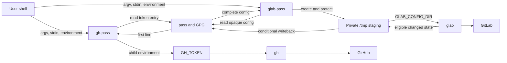

# Threat model

This document describes the security model for `forge-cli-pass`: the assets it
handles, the boundaries it crosses, the threats it addresses, and the risks it
deliberately accepts.

Accepted Architecture Decision Records (ADRs) are authoritative. This document
integrates those decisions into a current operational model; source and tests
provide implementation evidence.

## Purpose

`forge-cli-pass` provides command-compatible wrappers around the GitHub CLI
(`gh`) and GitLab CLI (`glab`). The wrappers keep durable authentication state
in `pass` and expose that state to a parent CLI only for one invocation.

The primary security invariant is:

> Durable forge CLI authentication state remains in `pass`; transient
> authentication state exists only for the duration and scope required by the
> invoked parent command.

The project reduces persistent credential residue. It is not a sandbox, vault,
privilege boundary, or defense against a compromised user account.

## Scope

### In scope

- selecting and reading wrapper-managed entries from `pass`
- injecting a GitHub token through `GH_TOKEN`
- staging the complete GitLab CLI configuration beneath `/tmp`
- detecting and persisting eligible GitLab authentication-state changes
- rejecting credential-management and credential-disclosure operations
- preserving arguments, standard input, output streams, and exit status
- handling ordinary failure and HUP, INT, and TERM
- cleaning up transient GitLab runtime state
- narrow installation and removal of wrapper commands
- source-release identity and provenance

### Out of scope

- a compromised local user, kernel, filesystem, terminal, or shell
- a compromised `pass` store, GPG key, or GPG agent
- malicious or compromised `gh`, `glab`, `pass`, or supporting utilities
- Git remotes, SSH keys, deploy keys, signing keys, or host-key verification
- forge-side permissions, authorization policy, or service implementation
- extensions or plugins loaded by the parent CLIs
- network trust, TLS validation, proxies, or certificate stores
- secure erasure after temporary files are removed
- recovery after SIGKILL, kernel failure, power loss, or machine reset

## System overview

The wrappers use different delivery mechanisms because the parent CLIs expose
different authentication interfaces:

- `gh-pass` uses the first line of its selected `pass` entry as `GH_TOKEN` and
  replaces itself with `gh`.
- `glab-pass` restores its selected entry as an opaque GitLab CLI config,
  executes `glab`, conditionally persists changed state, and removes the
  runtime directory.

## Assets

| ID | Asset | Required property |
|---|---|---|
| A-01 | GitHub access token | Confidentiality and correct selection |
| A-02 | GitLab access and refresh-token configuration | Confidentiality, integrity, and availability |
| A-03 | Wrapper-managed `pass` entries | Integrity and controlled mutation |
| A-04 | Transient GitLab runtime configuration | Confidentiality, integrity, and bounded lifetime |
| A-05 | Parent invocation semantics | Integrity of argv, stdin, stdout, stderr, status, and signal result |
| A-06 | Authentication policy | Credential ownership and non-disclosure |
| A-07 | Release identity | Provenance, immutability, and correspondence to verified source |
| A-08 | Diagnostic integrity | Accurate failure reporting without credential disclosure |

## Security objectives

1. **Keep durable credentials in `pass`.** Parent CLI default configuration
   directories are not authoritative for wrapper-managed state.
2. **Minimize transient exposure.** Credential material is exposed only through
   the mechanism required by the selected parent CLI and only during execution.
3. **Prevent unintended credential mutation or disclosure.** Incompatible
   authentication operations fail before credential retrieval or staging.
4. **Preserve eligible GitLab changes.** Refreshed state is written back after
   ordinary success, ordinary failure, and handled signals when valid.
5. **Reject invalid state transitions.** Missing, empty, unreadable,
   non-regular, or unhashable state never replaces durable state.
6. **Preserve command compatibility.** Arguments, stdin, output streams, and
   ordinary parent status remain transparent unless a wrapper obligation fails.
7. **Preserve causal signal outcomes.** HUP, INT, and TERM retain their
   documented final statuses after recovery and cleanup attempts.
8. **Preserve release provenance.** A release identifies an existing annotated
   tag resolving to a verified commit present on both upstreams.

## Actors and assumptions

### Trusted

The model assumes the following are trustworthy enough for local operation:

- the invoking user and shell session
- kernel and filesystem permission enforcement
- the user's `pass` store, GPG keys, and GPG agent
- commands resolved through `PATH`, including `gh`, `glab`, `pass`, `mktemp`,
  `chmod`, `rm`, and `sha256sum`
- the parent CLIs' credential, configuration, and network behavior
- GitHub and GitLab to enforce their own authorization rules

### Adverse conditions addressed

- accidental misuse by the invoking user
- missing dependencies or credential entries
- malformed or ambiguous entry overrides
- empty or structurally invalid credential state
- ordinary parent failure
- parent mutation of GitLab authentication state
- HUP, INT, or TERM during parent execution
- permission, hashing, writeback, or cleanup failure
- another unprivileged local user attempting to inspect predictable `/tmp`
  paths
- upstream behavior changes discovered by tests or real use

### Excluded adversaries

- root or another actor able to bypass filesystem permissions
- an attacker already executing as the invoking user
- an attacker able to replace trusted commands or wrapper source
- a malicious parent CLI or parent CLI extension
- forensic recovery of deleted temporary data

## Trust boundaries

| ID | Boundary | Data crossing it | Primary concern |
|---|---|---|---|
| TB-01 | User shell to wrapper | argv, stdin, environment, signals | Input integrity and compatibility |
| TB-02 | Wrapper to `pass` | entry name, credential read, writeback | Correct selection and durable-state integrity |
| TB-03 | `gh-pass` to `gh` | `GH_TOKEN`, argv, stdin, inherited streams | Token exposure and transparency |
| TB-04 | `glab-pass` to `/tmp` | complete GitLab configuration | Temporary-state confidentiality and integrity |
| TB-05 | `glab-pass` to `glab` | config path, argv, stdin, streams, signals | State mutation and transparency |
| TB-06 | Parent CLI to forge | authenticated requests and responses | Delegated remote trust |
| TB-07 | Source checkout to release | commit, tag, release record | Provenance and immutability |

## Data flows

### GitHub

1. Enforce the wrapper authentication policy.
2. Resolve the default or explicitly configured `pass` entry.
3. Read the complete entry and extract only its first line.
4. Reject an empty token and clear the complete retrieved value.
5. Replace the wrapper with `gh`, setting `GH_TOKEN` for that process.

### GitLab

1. Enforce the wrapper authentication policy.
2. Resolve the default or explicitly configured `pass` entry.
3. Verify `/tmp`, create an unpredictable directory with `mktemp -d`, and
   apply restrictive permissions.
4. Restore and validate the complete opaque GitLab configuration.
5. Fingerprint the initial state.
6. Preserve caller stdin and launch `glab` asynchronously for signal handling.
7. Validate and fingerprint post-command or interrupted state.
8. Write back the complete state only when it changed and remains eligible.
9. Remove the runtime directory.
10. Return the parent, wrapper, or signal status required by the accepted
    precedence rules.

## Threat register

### TM-01: Wrong or malicious dependency resolved through `PATH`

**Scenario:** The wrapper invokes an unexpected executable named `pass`, `gh`,
`glab`, `mktemp`, `chmod`, `rm`, or `sha256sum`.

**Controls:** Required commands are checked; calls use `command` to bypass shell
functions and aliases; dependencies are explicit; CI uses controlled fixtures
and a checksum-verified test BusyBox build.

**Residual risk:** `command` does not authenticate an executable. A malicious
binary earlier in `PATH` can obtain credentials or subvert behavior.

**Disposition:** Accepted as part of the trusted local environment.

### TM-02: Credential disclosure through tracing or diagnostics

**Scenario:** Shell tracing, wrapper errors, or status output reveals a token or
complete GitLab config.

**Controls:** Both wrappers use `set +x`; diagnostics avoid credential content;
known token-display options fail before retrieval or staging; writeback tests
verify that error output excludes credential material.

**Residual risk:** The parent CLI, terminal, debugger, process inspector, or an
ordinary API command can expose sensitive data. Parent output is not sanitized.

**Disposition:** Mitigated within wrapper-controlled behavior.

### TM-03: GitHub token exposure through the process environment

**Scenario:** The token is observable while `gh` runs because it is supplied as
`GH_TOKEN`.

**Controls:** The token is provided only for one invocation; no wrapper-managed
GitHub config is created; only the first entry line is injected; the complete
retrieved value is cleared before `exec`.

**Residual risk:** The child, kernel, and sufficiently privileged process
inspection can observe the environment. Environment injection is a parent CLI
interface, not a secrecy boundary.

**Disposition:** Accepted and documented.

### TM-04: Unauthorized access to transient GitLab state

**Scenario:** Another local user predicts, reads, replaces, or modifies the
staged config beneath `/tmp`.

**Controls:** `mktemp -d`; `/tmp/glab-pass.XXXXXX`; `umask 077`; directory mode
`0700`; config mode `0600`; no use of the normal persistent config directory.

**Evidence:** ADR 0005; `src/glab-pass`; staging-contract and permission-failure
tests.

**Residual risk:** Root, a compromised kernel, or an attacker already operating
as the invoking user can bypass the controls.

**Disposition:** Mitigated for other unprivileged local users.

### TM-05: Invalid GitLab state replaces durable state

**Scenario:** Missing, empty, unreadable, non-regular, truncated, or otherwise
ineligible staged state is written back to `pass`.

**Controls:** Initial and post-command state must exist, be readable, be a
regular file, be non-empty, and be successfully fingerprinted. Writeback occurs
only after validation. Wrapper failure takes precedence when state protection
fails.

**Evidence:** Tests for missing, empty, non-regular, and unhashable state;
writeback-failure and multi-failure tests.

**Residual risk:** Structural validation does not prove that an opaque config is
semantically correct. Semantic validity is delegated to `glab`.

**Disposition:** Structurally mitigated.

### TM-06: Legitimate GitLab changes are lost

**Scenario:** `glab` refreshes authentication state, but parent failure or a
signal prevents the changed config from returning to `pass`.

**Controls:** Before-and-after fingerprints; writeback after ordinary success
and failure; conditional recovery after HUP, INT, and TERM; signal-specific
final statuses preserved after recovery attempts.

**Evidence:** Changed-state tests after success and failure; HUP, INT, and TERM
tests; signal-time writeback-failure tests.

**Residual risk:** Recovery cannot run after SIGKILL, kernel failure, power loss,
or storage failure.

**Disposition:** Mitigated for ordinary failure and handled signals.

### TM-07: Temporary GitLab state remains after execution

**Scenario:** Cleanup fails and reusable credential material remains on disk.

**Controls:** Success, failure, and handled-signal paths attempt cleanup;
cleanup failure is reported; ordinary cleanup failure becomes wrapper status
`1`; tests assert cleanup across execution paths.

**Residual risk:** Removal is not secure erasure and cannot be guaranteed after
abrupt termination. Data may remain in journals, snapshots, swap, or backups.

**Disposition:** Operationally mitigated; forensic and abrupt-termination risks
accepted.

### TM-08: Authentication commands bypass wrapper ownership

**Scenario:** `auth login`, `auth logout`, token-display options, or a new
unknown auth command replaces, removes, or discloses wrapper-managed state.

**Controls:** Help and non-disclosing status are allowed; known management and
disclosure commands are rejected; unknown auth subcommands fail closed;
rejection occurs before retrieval or staging.

**Evidence:** ADR 0008 and authentication-policy tests for both wrappers.

**Residual risk:** A parent CLI may introduce credential-affecting behavior
outside its `auth` command tree.

**Disposition:** Mitigated through explicit policy and conservative defaults.

### TM-09: Wrapper changes parent command behavior

**Scenario:** Arguments are split, stdin is lost, output changes, status codes
are collapsed, or signal outcomes differ from direct parent invocation.

**Controls:** `"$@"` argument forwarding; explicit stdin preservation for
asynchronous `glab`; inherited stdout and stderr; `exec` for `gh`; exact
ordinary status preservation; wrapper status `1`; signal statuses `129`, `130`,
and `143`.

**Evidence:** Argument-boundary tests, exact-status tests, the three-shell stdin
regression, and signal tests.

**Residual risk:** Complete equivalence cannot be proven for every future parent
command, shell, terminal mode, and upstream version.

**Disposition:** Mitigated through a defined compatibility contract and
cross-shell regression tests.

### TM-10: Wrong `pass` entry is selected

**Scenario:** An empty or malformed override, newline injection, or fallback
behavior selects or overwrites an unintended entry.

**Controls:** One documented default and override per provider; unset means
default; empty, newline, or carriage-return overrides fail; no discovery or
fallback; entry names remain single arguments.

**Evidence:** ADR 0009 and default, override, empty, whitespace, newline, and
carriage-return tests.

**Residual risk:** A syntactically valid override can intentionally select the
wrong entry. The invoking environment is trusted.

**Disposition:** Mitigated against ambiguity and injection.

### TM-11: Upstream CLI behavior invalidates assumptions

**Scenario:** `gh` or `glab` changes authentication interfaces, command
classification, config behavior, mutation patterns, or process semantics.

**Controls:** Provider-specific wrappers; opaque GitLab config handling;
explicit auth policy; behavioral tests under Dash, Bash POSIX mode, and BusyBox
`ash`; real-world use treated as compatibility evidence.

**Residual risk:** Fixtures cannot predict every upstream change. A regression
may first appear under a real command, as occurred with piped stdin.

**Disposition:** Ongoing maintenance risk.

**Review trigger:** Parent CLI updates, new auth commands, config changes, or a
field report demonstrating behavioral drift.

### TM-12: State fingerprinting is mistaken for authentication

**Scenario:** SHA-256 comparison is interpreted as proving that staged state is
authentic rather than only detecting that two observed files differ.

**Controls:** Hashing is used solely for change detection; local integrity rests
on filesystem permissions and trusted-component assumptions.

**Residual risk:** An actor able to alter state as the invoking user can cause
the wrapper to fingerprint and persist the altered state.

**Disposition:** Accepted; hashing is not an authenticity boundary.

### TM-13: Wrapper failure obscures parent failure

**Scenario:** A parent command fails and a later writeback or cleanup failure
hides the original context.

**Controls:** Exact parent status is retained when wrapper obligations succeed;
when they fail, diagnostics report parent and wrapper failures where applicable;
simultaneous writeback and cleanup failures are both reported.

**Residual risk:** One exit status cannot represent multiple failures. Wrapper
status `1` represents failed wrapper obligations; diagnostics preserve context.

**Disposition:** Mitigated through explicit precedence and multi-failure
reporting.

### TM-14: A release does not correspond to verified source

**Scenario:** A release is created from an unintended commit, implicit tag,
unverified tree, or tag that differs between upstreams.

**Controls:** Semantic Versioning; annotated tags; protected `main`; required
up-to-date CI; matching `VERSION` and changelog; complete local verification;
commit and tag on both upstreams; protection of `v*` tags against update and
deletion; canonical GitHub release verifies the remote tag; published releases
are not replaced in place.

**Evidence:** ADR 0013, annotated release tags, CI records, GitHub releases, and
mirrored GitLab tags.

**Residual risk:** Hosting-provider source archives are not independently built
or attested. Maintainer key or account compromise is outside this model.

**Disposition:** Mitigated for the documented source-release process.

### TM-15: Installation damages unrelated command paths

**Scenario:** Install or uninstall overwrites a pre-existing file, removes a
path not owned by the project, or removes a development link for another
checkout.

**Controls:** Narrow copy installation and uninstall; development install
refuses regular files; development uninstall removes only matching checkout
links; custom prefix, binary directory, and `DESTDIR` support.

**Evidence:** ADR 0010 and the installation/development-link test suite.

**Residual risk:** A privileged or incorrectly targeted manual operation can
still modify system paths. The Makefile does not acquire privileges itself.

**Disposition:** Mitigated through narrow ownership and guarded operations.

## Residual-risk summary

The most important accepted residual risks are:

- local compromise can observe or replace credentials
- the parent CLI must see credential material while it runs
- SIGKILL, power loss, or kernel failure can prevent writeback and cleanup
- removing files does not guarantee secure erasure
- parent CLI changes can invalidate assumptions before tests detect them
- opaque GitLab state is structurally validated, not semantically authenticated
- ordinary parent commands may intentionally emit sensitive data
- hosting-provider source archives are not independently attested

Addressing these risks would require a different system boundary, such as
OS-level isolation, a dedicated credential broker, authenticated IPC, changes
to the parent CLIs, or a generated-artifact supply-chain process.

## Verification strategy

| Layer | Evidence |
|---|---|
| Static analysis | ShellCheck in POSIX `sh` mode |
| Syntax | Dash, Bash POSIX mode, and BusyBox `ash` |
| GitHub behavior | Entry selection, first-line extraction, policy, arguments, exact status |
| GitLab behavior | Private staging, validation, writeback, cleanup, signals, stdin |
| Installation | Copy and staged install, custom paths, narrow uninstall, guarded links |
| Continuous integration | GitHub Actions runs the accepted verification interface |
| Repository controls | Protected `main`, required `CI/Verify`, full-SHA Action pins, Dependabot, Scorecard |
| Release process | Protected annotated tags, matching upstream commits, verified CI commit, canonical release |

Tests are evidence that controls are implemented. They are not proof that the
trusted operating system, dependencies, or remote services are secure.

## Review triggers

Review this threat model when:

- a runtime dependency or external command is added
- a provider, operating system, or shell is added
- `gh` or `glab` changes auth commands, flags, environment variables, config
  paths, or config semantics
- the project begins parsing or transforming GitLab configuration
- staging location, permissions, signal handling, asynchronous execution,
  stdin handling, or status precedence changes
- a new credential-bearing environment variable or file is introduced
- installation begins requiring privileges or writing outside selected command
  paths
- generated artifacts, packages, checksums, attestations, or automated release
  publication are added
- a security report, compatibility bug, or dependency vulnerability invalidates
  an assumption
- repository rules, CI permissions, dependency-update policy, or release-tag
  protections change
- an accepted ADR changes a security boundary or compatibility contract

## Related documents

- [`architecture.md`](architecture.md) — integrated current architecture
- [`project-context.md`](project-context.md) — problem statement and context
- [`decisions/README.md`](decisions/README.md) — ADR authority and index
- [`../SECURITY.md`](../SECURITY.md) — vulnerability-reporting policy
- [`../README.md`](../README.md) — user-facing behavior and installation
- [`../tests/`](../tests/) — executable behavioral evidence
